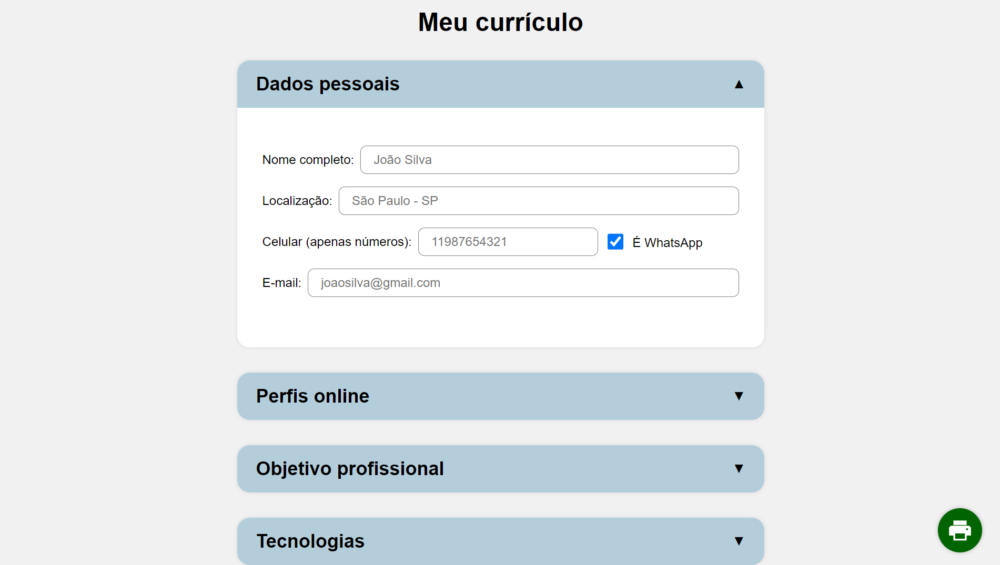

# Meu Currículo

Este é um Web App que permite aos usuários gerar currículos imprimíveis. Os usuários podem preencher os formulários com suas informações pessoais, educacionais e profissionais, e o aplicativo gera um currículo formatado que pode ser impresso ou salvo como PDF.
O projeto foi proposto pelo site [The Odin Project](https://www.theodinproject.com). Acesse o site do projeto em [diego-moreira8.github.io/cv-app](https://diego-moreira8.github.io/cv-app/) ou siga os passos de instalação abaixo.



## Funcionalidades

- Formulário voltado para desenvolvedores;
- Geração de um documento que pode ser imprimido ou salvo como PDF;
- Links funcionais para o currículo salvo como PDF;
- Local storage, para que os dados permaneçam salvos no navegador.

## Tecnologias Utilizadas

- React
- TypeScript
- CSS Modules

## Instalação

### Pré-requisitos

- Git
- Node.js

### Instruções

1. Clone o repositório:

```bash
git clone https://github.com/Diego-Moreira8/cv-app.git
```

2. Navegue até o diretório do projeto:

```bash
cd cv-app
```

3. Instale as dependências:

```bash
npm install
```

4. Execute o projeto:

```bash
npm run dev
```

5. Acesse o projeto pelo navegador: http://localhost:5173/

## Licença

Este projeto está licenciado sob a Licença MIT. Veja o arquivo [LICENSE](./LICENSE.md) para mais detalhes.

## Contato

Se você tiver alguma dúvida ou sugestão, sinta-se à vontade para [entrar em contato](mailto:diego.moreira529@gmail.com)!
